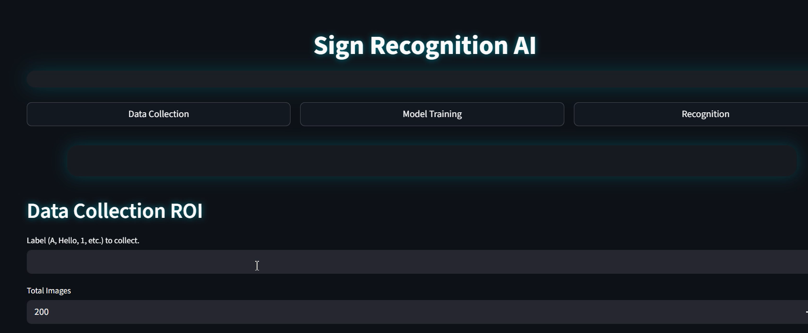

#  Sign Recognition AI  
### Real-Time Hand Gesture Detection • ROI Extraction • CNN Classification • Streamlit UI

## Overview  
This project is a **real-time Sign Language Recognition system** built using:

- **OpenCV** for video input  
- **MediaPipe** for fast hand-landmark detection  
- **ROI-based dataset generation**  
- **MobileNet-CNN** for gesture classification  
- **Streamlit (Cinematic UI)** for an elegant frontend  
- **Text-to-Speech** for audio feedback  
- **Auto word formation** using smoothing + open-palm (space gesture)

The system supports:

✔ Real-time recognition 
✔ ROI (hand-only) dataset capture  
✔ Training on custom gestures  
✔ Modern UI with background images  
✔ Word spacing using open-palm  
✔ Auto deletion of RAW frames after processing

---

## Features

### 1. ROI-based Data Collection
- Captures raw frames + hand-cropped ROI images  
- Automatically extracts **square ROI** around hand  
- Saves processed images for model training  
- Live FPS counter & bounding box visualization  
- Press **q** to stop capturing  

### 2. MobileNet CNN Training  
- Compact MobileNet classifier  
- Learns custom gestures (A–Z, words, signs)  
- Saves model + labels automatically  
- Handles class validation automatically  

### 3. Real-Time Recognition  
- High FPS inference using MediaPipe  
- Majority vote smoothing  
- Open palm = **space character**  
- Cinematic UI with neon glow  
- FPS, confidence & word counter  

---

## Project Structure

```
sign-language-recognition/
│
├── config/
│   └── settings.py
│
├── modules/
│   ├── dataset_builder.py
│   ├── model_trainer.py
│   ├── streamlit_utils.py
|   ├── preprocess_dataset.py
│   ├── tts_engine.py
│   └── utils.py
│
├── data/
│   ├── raw/
│   └── processed/
│   └── labels.txt
├── models/
│   ├── cnn_model.h5
│
├── main.py
└── README.md
└── requirements.txt
```

---

## ▶ Running the App

### 1. Clone and  Install dependencies  
```bash
pip install -r requirements.txt
```

### 2. Run Streamlit  
```bash
streamlit run main.py
```

---

### Screenshots  


---

## Dataset Pipeline  

### Step 1 — RAW Data  
Saved temporarily in `data/raw/<label>`  
Auto-deleted after processing.

### Step 2 — ROI Extraction  
Hand landmarks → Square crop → Resize → `data/processed/<label>`

### Step 3 — Training  
Uses processed dataset only.

---

## Training  
From UI → “Model Training” → Click:

```
Start Training
```

---
## Recognition
From UI → “Recognition” → Click:

```
Start Recognition
```